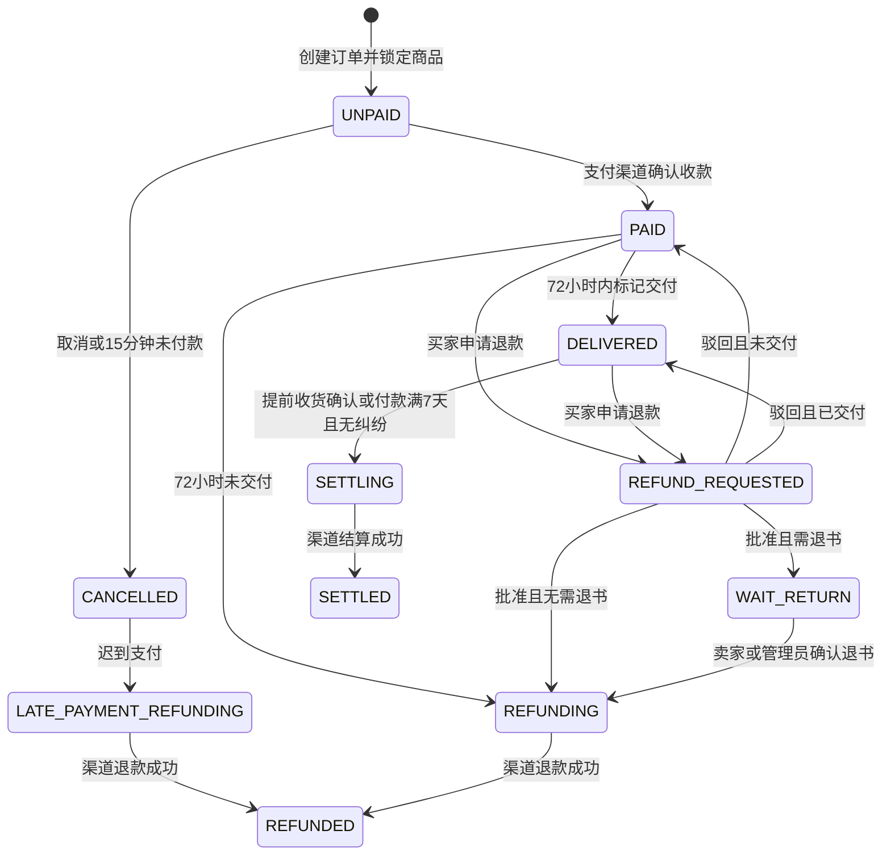

# 架构与业务接口

## 服务边界

首版采用单体 NestJS 服务，HTTP API、WebSocket 和数据库任务消费者运行在同一个进程。Vue 管理后台与原生微信小程序共用 `/v1` API。PostgreSQL 是业务和任务状态的唯一来源，图片可采用本地存储或 S3 兼容对象存储。

后端划分登录、教材目录、交易、聊天、运营、存储、事件通知和任务处理模块。支付通过 `PaymentProvider` 抽象隔离；当前只有 `MockPaymentProvider`，且只允许在非生产环境启动。

## 核心状态

资金金额使用整数分。订单保存教材内容、价格及手续费快照。卖家改价只改变商品的当前价格。结算后退款仅人工协调；结算请求已发出后也不能通过投诉自动撤销渠道转账。

## 数据一致性

- 业务状态转换使用 PostgreSQL Serializable 事务；冲突事务有限重试。
- 消息写入使用会话行锁及 ReadCommitted 事务，避免同一会话的大量消息因 Serializable 冲突反复回滚；消息唯一标识保证重试不重复。
- `single_live_order_per_product` 部分唯一索引阻止同一教材存在多个有效交易；商品状态更新同时锁定库存。
- 支付、退款、结算与资金阶段流水都有唯一键；重复回调和任务重试使用同一操作标识。
- 事务内创建通知和任务。消费者通过 `FOR UPDATE SKIP LOCKED` 获取租约，执行外部渠道操作后再提交结果。
- 任务失败按指数退避重试，最多 8 次；租约超过 5 分钟可恢复。完成更新须携带当前租约 token，避免旧进程覆盖新租约状态。
- 外部渠道必须支持幂等请求，或查询并恢复已有操作。数据库事务无法撤销已经发生的真实转账。
- 迟到支付只退款原订单，不修改已经被新订单锁定的教材。
- 退款完成后的正常商品下架，须卖家核实持有实物后编辑并重新审核。

数据库外键保留审核、订单、消息与资金记录之间的关联。部分唯一索引和金额检查由第二次 SQL 迁移维护，后续迁移不得移除这些约束。

## 接口约定

所有 API 错误返回 `{ statusCode, message }`。私有接口使用 `Authorization: Bearer <JWT>`，JWT 只携带用户 ID；每个请求重新读取账号的封禁、认证和角色状态。

| 功能 | 主要接口                                                                                                   |
| ---- | ---------------------------------------------------------------------------------------------------------- |
| 登录 | `POST /v1/auth/wechat`、`POST /v1/auth/admin`                                                              |
| 教材 | `GET /v1/products`、`POST /v1/products`、`POST /v1/products/:id/edit`、`POST /v1/products/:id/price`       |
| 认证 | `POST /v1/media` 上传 IDENTITY 图片，`POST /v1/verifications` 提交                                         |
| 交易 | `POST /v1/orders`、`POST /v1/orders/:id/pay`、`POST /v1/orders/:id/deliver`、`POST /v1/orders/:id/confirm` |
| 退款 | `POST /v1/orders/:id/refunds`、`POST /v1/refunds/:id/return`                                               |
| 聊天 | `POST /v1/conversations`、`GET/POST /v1/conversations/:id/messages`、`POST /v1/orders/:id/conversation`    |
| 运营 | `/v1/admin/lists/:entity`，对应审核、封禁、维护和对账接口                                                  |
| 图片 | `GET /files/public/:id`、`GET /v1/media/:id/url` 获取限时私有 URL                                          |

微信 `wx.request` 支持的方法中不包含 PATCH，因此小程序的修改操作使用 POST。搜索分页固定每页 20 条；消息使用消息 ID 游标，即使多个消息时间相同也不会跳过记录。完整输入字段以运行中的 OpenAPI JSON 为准。

WebSocket `/v1/ws` 握手携带 Authorization 请求头，只开放给已认证用户；接收 `ready`、`message`、`read`、`notification` 事件。消息发送使用 HTTP 保证校验与持久化；小程序断线后指数退避重连，并重新查询持久消息。

## 图片与通知

只接收 5MB 内的 JPEG、PNG、WebP，解码后限制像素、清除原始元数据并转为 WebP。教材图片可公开；认证材料、聊天图片和投诉证据为私有。证明限管理员查看，聊天图片限参与者或管理员查看，签名 URL 120 秒有效且禁止缓存。每次身份申请必须重新上传图片，避免旧申请的清理任务删除新申请材料。

认证材料审核后创建 7 天删除任务；图片删除保留审核结果。微信订阅消息需要用户授权、获准的模板 ID 和匹配模板字段；未配置或未授权仍有站内通知。网络故障时订阅消息重试可能产生重复送达，站内通知 ID 不变。
